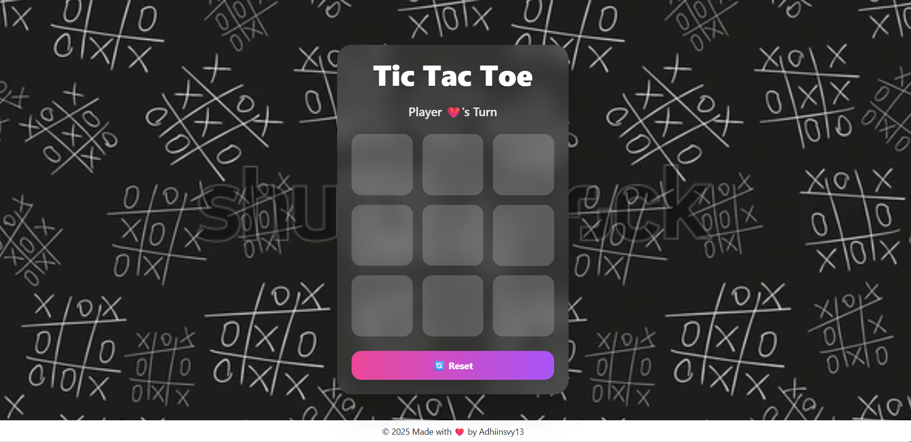

# 🎮 Tic Tac Toe — Emoji Edition

A fun **two-player Tic Tac Toe** game using **unique emojis** instead of X and O, built with **HTML, CSS (Tailwind), and JavaScript**.  

---

## ✨ Features

- Two-player gameplay 🧑‍🤝‍🧑  
- Emoji symbols: ❤️ (heart) vs 🧠 (brain)  
- Smooth animations & responsive design 📱  
- Reset / Play Again button 🔁  

---

## Motivation

To **polish frontend skills** and practice **game logic implementation** using web technologies.

---

## 💖 Contributions

The project is **open to contributions**:  
- Add new emoji sets  
- Improve UI/UX or animations  
- Refactor code for better readability  

---

## 📸 Preview

Player ❤️ vs Player 🧠  

